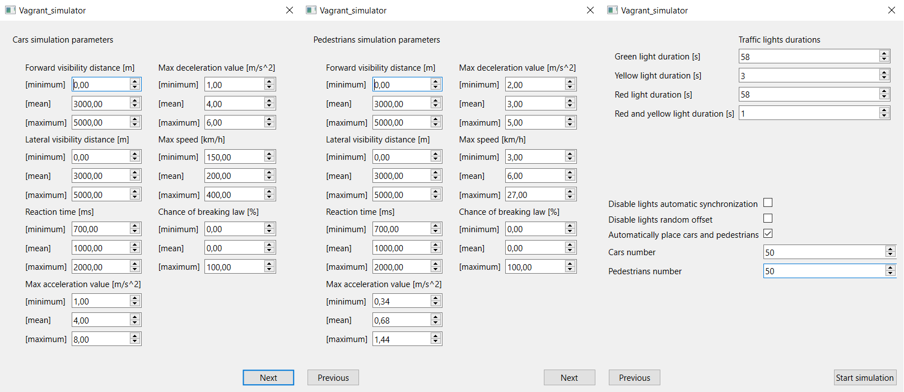

# Traffic_simulator

This project is a simplified traffic simulator. The main inspiration for its creation was the desire to pass another course requiring writing an application in C++, but the result is satisfactory enough to be included here.

## Main features
+ **Map creation:** The graphic interface allows you to create a map from ready-made elements, saving it and loading it later.
These elements can be divided into two main groups: road elements and elements that allow traffic control.
The first group includes the roadway, intersection, sidewalk and pedestrian crossing, with the roadway having several variants that differ in the number of lanes.
The second group includes traffic lights and road signs that comply with the Polish traffic law. At the moment it is possible to choose from 15 signs from different categories. 
Due to the need to maintain certain rules of map structure for simulation purposes, the position of added map elements is validated in real time, which is expressed clearly by the color surrounding the element.
It is not possible to switch to simulation until all elements are placed correctly. Missing traffic lights are filled in an automatic manner. 
+ **Simulation:**
  + **Configuration and management of the simulation:** The user can set the parameters of the simulation both before it starts and during its operation.
  Adjustable parameters include, but are not limited to, the range of visibility of traffic users, their maximum speed, acceleration as well as the frequency of traffic signal changes. 
  It is possible to select how many pedestrians and cars should be placed automatically, as well as add them manually.
  It is possible to change the frequency of operation, or disable individual lights, as well as change individual parameters of cars and pedestrians.
  The user can pause simulation or change its speed.
  + **Movement of traffic users:** It is possible to simulate the movement of cars and pedestrians automatically or choose destinations for individual traffic users. Traffic users move (or at least they should) according to the traffic law.
  There is a chance to perform an action which breaks traffic law, which can be adjusted by modifying the corresponding parameter (chance of breaking the law with range 0-100%).

For those who would rather see it in action, wait a moment, gifs with a simple demo are loading beneath.
**Map creation:**

**Simulation:**

Pop-up dialogs were not recorded, so here is a simulation configuration which led to the result shown above:

## Built with
Qt 5.15.

## License
This project is licensed under GPLv3 license.

